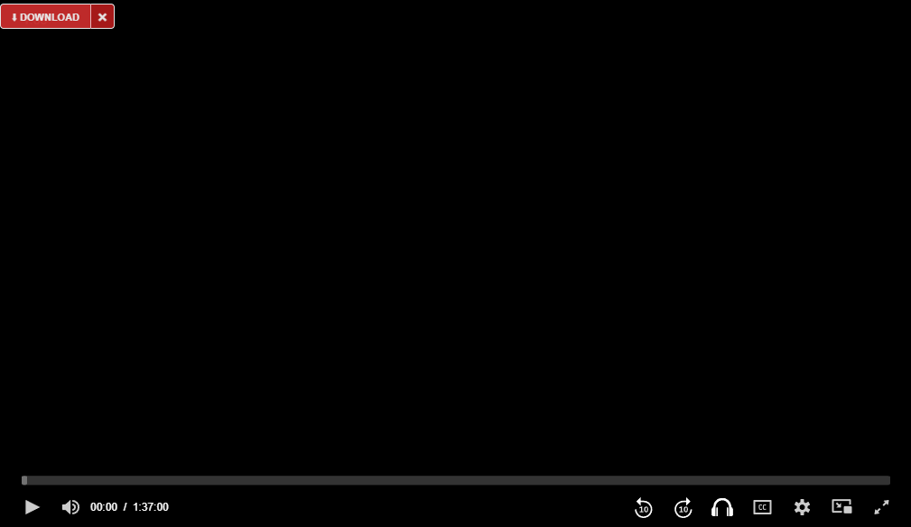
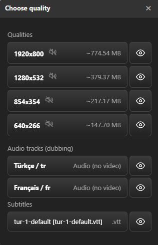
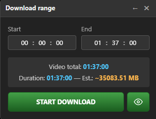
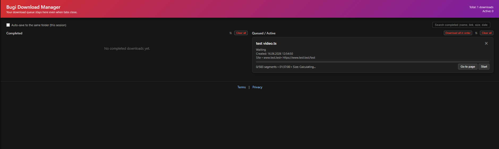
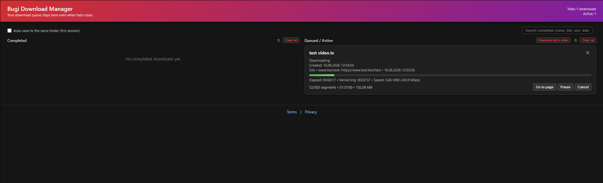
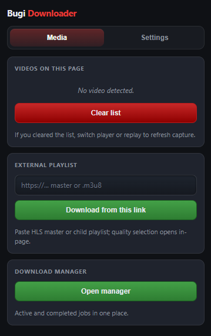
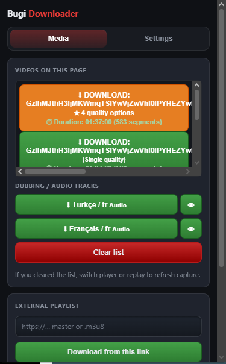
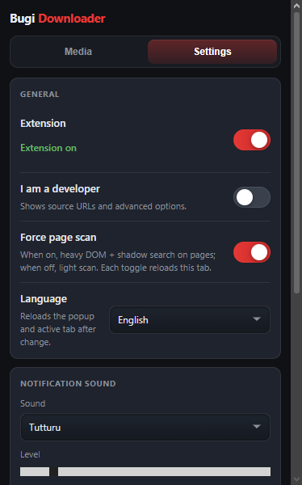
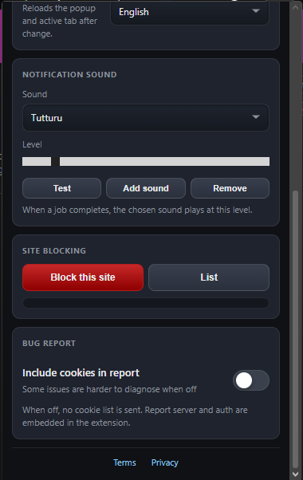

# Bugi Video Downloader

Bugi Video Downloader is a powerful and simple browser extension that automatically detects media (video/audio) files on websites and allows you to download them. It specifically helps you detect and download videos in **HLS (m3u8)** and **MP4** formats.

## Screenshots 📸

  
  
  
  
  
  
  
  
  

## Features ✨
- **Automatic Detection:** Automatically detects media files being played or loaded on the web pages you visit in the background.
- **HLS and MP4 Support:** Can download segmented (HLS/m3u8) streams and merge them into a single file. Also supports standard MP4 files.
- **Download Manager:** Includes a dedicated download panel where you can view, pause, and resume all your active download tasks.
- **Concurrent Downloading:** Provides high-speed downloads by fetching multiple HLS segments simultaneously (the number of concurrent connections can be limited in settings).
- **Privacy Focused:** The download process happens entirely locally within your browser and on your machine. Your data is never sent to any third-party servers. (All bug reporting and analytics tools have been completely removed.)
- **Multi-Language Support:** The extension interface can be translated into different languages.
- **Notifications:** Optionally sends audio notifications when a download completes or an error occurs.

## Installation 🛠️

You can currently install this extension in developer mode (as an unpacked extension):

1. Download this repository to your computer as a ZIP file and extract it, or clone it using `git clone`.
   *(If you haven't already, you can safely delete the unused `mux.min.js` and `update-message.json` files from the folder before installation.)*
2. Go to your browser's extensions page:
   - **Chrome / Brave:** Type `chrome://extensions/` in your address bar.
   - **Edge:** Type `edge://extensions/` in your address bar.
   - **Opera:** Type `opera://extensions/` in your address bar.
3. Enable **Developer mode** from the top right corner (or bottom left corner, depending on the browser).
4. Click the **"Load unpacked"** button.
5. Select the extracted or cloned folder (the main folder containing the `manifest.json` file).
6. The extension will be installed, and its icon will appear in your browser's toolbar! 🎉

## How to Use 🚀
1. Go to a website and play the video you want to download.
2. **On-page Download Button:** If a video is detected, a download button will automatically appear in the top-left corner of the video player itself. You don't have to use the popup menu to download!
3. Alternatively, a small red/green notification dot on the extension icon indicates that a video has been detected on the page. Click the icon to see the list of detected videos.
4. **Quality Options:** If the detected video source is marked with a **yellow** badge, multiple quality options are available to choose from. If it is not yellow, it means only a single quality is available for that video.
5. Click the **"Download"** button next to a video (or use the on-page button) to add it to the download manager.
6. You can monitor the progress of your download from the Download Manager page.

## Disclaimer ⚠️
This extension is designed solely for users to download free or permitted content for personal use, without violating copyright laws. Downloading and distributing copyrighted material without permission is illegal. Users are solely responsible for the content they download using this tool.

---
**Developer Note:** This extension is fully compliant with "Manifest V3" standards.
